Missing Data Imputation through Chained equations
================
Author: Mansoor


Abstract:
---------

This project analyses various imputation methods for dealing with missingness in Diabetes dataset. Exploratory data analysis is performed on the datasets in finding the type and extent of missingness. Various techniques for dealing with missingness like complete case analysis, mean imputation and multiple imputation with chained equations (MICE) are applied over the dataset. The three methods of imputation are then compared by fitting linear models on the imputed datasets and analysing the resulting standard errors and estimates.

Dataset:
--------

The Data has been collected from 403 subjects of 1046 subjects interviewed in a study of African Americans in Central Virginia. The 403 subjects were the ones who were actually screened for diabetes. The data consists of 16 variables listed in table. Stab.glu is not considered in the imputation models as it directly denotes onset of diabetes.

``` r
library(VIM)
```

    ## Warning: package 'VIM' was built under R version 3.5.2

``` r
library(corrplot)
library(mice)
library(xtable)
set.seed(1234)
DM = read.csv("diabetes_C.csv") 
# dataset description with column names in report

DM = DM[,-c(2)] 
# removing stabalized gluscose from dataset
#DM[,14] = as.numeric(c(DM[,4]>7))
#DM = DM[,-4]
names(DM)
```

    ##  [1] "chol"   "hdl"    "ratio"  "glyhb"  "age"    "gender" "height"
    ##  [8] "weight" "frame"  "bp.1s"  "bp.1d"  "waist"  "hip"

``` r
head(DM)
```

    ##   chol hdl ratio glyhb age gender height weight frame bp.1s bp.1d waist
    ## 1  203  56   3.6  4.31  46 female     62    121     2   118    59    29
    ## 2  165  24   6.9  4.44  29 female     64    218     3   112    68    46
    ## 3  228  37   6.2  4.64  58 female     61    256     3   190    92    49
    ## 4   78  12   6.5  4.63  67   male     67    119     3   110    50    33
    ## 5  249  28   8.9  7.72  64   male     68    183     2   138    80    44
    ## 6  248  69   3.6  4.81  34   male     71    190     3   132    86    36
    ##   hip
    ## 1  38
    ## 2  48
    ## 3  57
    ## 4  38
    ## 5  41
    ## 6  42

``` r
#DM[,c(5,8)] = as.factor(DM[,c(5,8)])
```

``` r
#head(DM)
aggr(DM, numbers=TRUE, main= "Extent of missing values in each variable of Diabetic dataset")
```

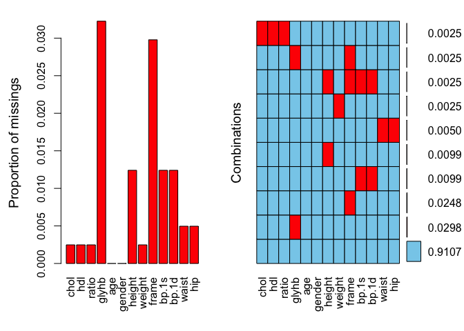

``` r
matrixplot(DM) # no relation found
```

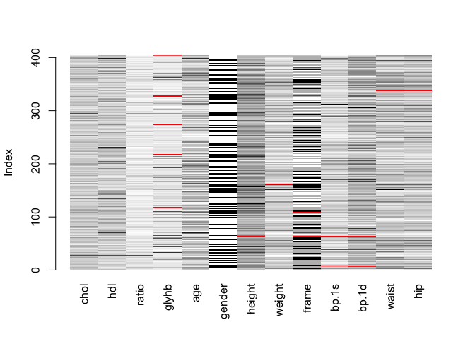

    ## 
    ## Click in a column to sort by the corresponding variable.
    ## To regain use of the VIM GUI and the R console, click outside the plot region.

``` r
#names(DM)
```

``` r
C=cor(DM[,-c(6,9)],use = "pairwise")
corrplot(C,type = "upper", order = "hclust",
         title = "Correlation Plot of Diabetes Dataset",method = "number")
```

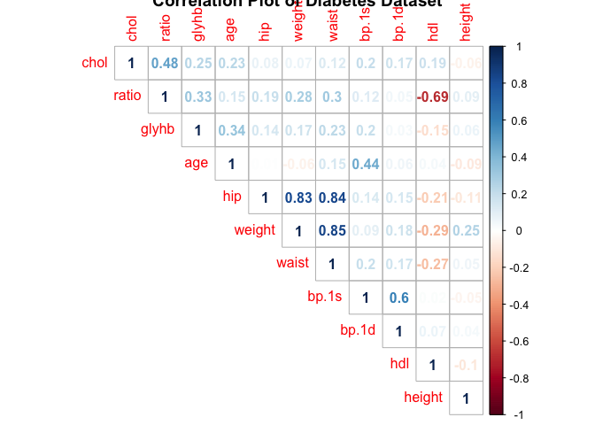

``` r
# complete case analysis
DM1 = na.omit(DM)
length(DM1[,1]) # 367 rows
```

    ## [1] 367

``` r
length(DM[,1]) # 403 rows
```

    ## [1] 403

``` r
names(DM1)
```

    ##  [1] "chol"   "hdl"    "ratio"  "glyhb"  "age"    "gender" "height"
    ##  [8] "weight" "frame"  "bp.1s"  "bp.1d"  "waist"  "hip"

``` r
y=DM1[,4]
X=DM1[,-4]
```

``` r
Model1=lm(y~.,data=X)
summary(Model1)
Model2=step(Model1)
```

``` r
summary(Model1)
```

    ## 
    ## Call:
    ## lm(formula = y ~ ., data = X)
    ## 
    ## Residuals:
    ##     Min      1Q  Median      3Q     Max 
    ## -3.1026 -1.1404 -0.4033  0.3779  9.6117 
    ## 
    ## Coefficients:
    ##               Estimate Std. Error t value Pr(>|t|)    
    ## (Intercept) -3.6855419  3.1624253  -1.165   0.2446    
    ## chol         0.0026899  0.0046078   0.584   0.5597    
    ## hdl          0.0058946  0.0143623   0.410   0.6817    
    ## ratio        0.3510530  0.1564389   2.244   0.0254 *  
    ## age          0.0331220  0.0082390   4.020 7.11e-05 ***
    ## gendermale  -0.2160856  0.3406172  -0.634   0.5262    
    ## height       0.0544762  0.0417640   1.304   0.1930    
    ## weight      -0.0001388  0.0072834  -0.019   0.9848    
    ## frame       -0.0489722  0.1793965  -0.273   0.7850    
    ## bp.1s        0.0061097  0.0067299   0.908   0.3646    
    ## bp.1d       -0.0082551  0.0103996  -0.794   0.4278    
    ## waist        0.0507672  0.0423030   1.200   0.2309    
    ## hip         -0.0038590  0.0478056  -0.081   0.9357    
    ## ---
    ## Signif. codes:  0 '***' 0.001 '**' 0.01 '*' 0.05 '.' 0.1 ' ' 1
    ## 
    ## Residual standard error: 1.995 on 354 degrees of freedom
    ## Multiple R-squared:  0.226,  Adjusted R-squared:  0.1998 
    ## F-statistic: 8.614 on 12 and 354 DF,  p-value: 2.076e-14

``` r
(summary(Model2))
```

    ## 
    ## Call:
    ## lm(formula = y ~ chol + ratio + age + waist, data = X)
    ## 
    ## Residuals:
    ##     Min      1Q  Median      3Q     Max 
    ## -3.2007 -1.1169 -0.4211  0.4178  9.5154 
    ## 
    ## Coefficients:
    ##             Estimate Std. Error t value Pr(>|t|)    
    ## (Intercept) 0.076917   0.811062   0.095   0.9245    
    ## chol        0.003930   0.002739   1.435   0.1522    
    ## ratio       0.299880   0.070312   4.265 2.55e-05 ***
    ## age         0.034698   0.006629   5.234 2.81e-07 ***
    ## waist       0.045601   0.018984   2.402   0.0168 *  
    ## ---
    ## Signif. codes:  0 '***' 0.001 '**' 0.01 '*' 0.05 '.' 0.1 ' ' 1
    ## 
    ## Residual standard error: 1.983 on 362 degrees of freedom
    ## Multiple R-squared:  0.2183, Adjusted R-squared:  0.2096 
    ## F-statistic: 25.27 on 4 and 362 DF,  p-value: < 2.2e-16

``` r
complete_case<-summary(Model2)
complete_case
```

    ## 
    ## Call:
    ## lm(formula = y ~ chol + ratio + age + waist, data = X)
    ## 
    ## Residuals:
    ##     Min      1Q  Median      3Q     Max 
    ## -3.2007 -1.1169 -0.4211  0.4178  9.5154 
    ## 
    ## Coefficients:
    ##             Estimate Std. Error t value Pr(>|t|)    
    ## (Intercept) 0.076917   0.811062   0.095   0.9245    
    ## chol        0.003930   0.002739   1.435   0.1522    
    ## ratio       0.299880   0.070312   4.265 2.55e-05 ***
    ## age         0.034698   0.006629   5.234 2.81e-07 ***
    ## waist       0.045601   0.018984   2.402   0.0168 *  
    ## ---
    ## Signif. codes:  0 '***' 0.001 '**' 0.01 '*' 0.05 '.' 0.1 ' ' 1
    ## 
    ## Residual standard error: 1.983 on 362 degrees of freedom
    ## Multiple R-squared:  0.2183, Adjusted R-squared:  0.2096 
    ## F-statistic: 25.27 on 4 and 362 DF,  p-value: < 2.2e-16

``` r
round(complete_case$coefficients[,1],3) 
```

    ## (Intercept)        chol       ratio         age       waist 
    ##       0.077       0.004       0.300       0.035       0.046

``` r
# coeefecients or estimates
round(complete_case$coefficients[,2],3)
```

    ## (Intercept)        chol       ratio         age       waist 
    ##       0.811       0.003       0.070       0.007       0.019

``` r
# standard errors
```

``` r
#simple model, imputation with mean
M.imp = mice(DM,method = "mean",m=20)
names(M.imp)
M.imp$imp
```

``` r
y=DM[,4]
X=DM[,-4]
Model3=with(M.imp,lm(y~ratio+age+waist,data=X))
```

``` r
#Model3=step(Model3)
summary(Model3)
```

    ## # A tibble: 80 x 5
    ##    term        estimate std.error statistic       p.value
    ##    <chr>          <dbl>     <dbl>     <dbl>         <dbl>
    ##  1 (Intercept)   0.791    0.713        1.11 0.268        
    ##  2 ratio         0.319    0.0626       5.10 0.000000541  
    ##  3 age           0.0384   0.00635      6.05 0.00000000355
    ##  4 waist         0.0414   0.0189       2.19 0.0292       
    ##  5 (Intercept)   0.791    0.713        1.11 0.268        
    ##  6 ratio         0.319    0.0626       5.10 0.000000541  
    ##  7 age           0.0384   0.00635      6.05 0.00000000355
    ##  8 waist         0.0414   0.0189       2.19 0.0292       
    ##  9 (Intercept)   0.791    0.713        1.11 0.268        
    ## 10 ratio         0.319    0.0626       5.10 0.000000541  
    ## # ... with 70 more rows

``` r
pool(Model3)
```

    ## Class: mipo    m = 20 
    ##               estimate         ubar b            t dfcom       df riv
    ## (Intercept) 0.79146927 5.082428e-01 0 5.082428e-01   383 380.9774   0
    ## ratio       0.31903944 3.916659e-03 0 3.916659e-03   383 380.9774   0
    ## age         0.03838076 4.031159e-05 0 4.031159e-05   383 380.9774   0
    ## waist       0.04136111 3.572002e-04 0 3.572002e-04   383 380.9774   0
    ##             lambda        fmi
    ## (Intercept)      0 0.00520864
    ## ratio            0 0.00520864
    ## age              0 0.00520864
    ## waist            0 0.00520864

``` r
(summary(pool(Model3)))
```

    ##               estimate   std.error statistic       df      p.value
    ## (Intercept) 0.79146927 0.712911495  1.110193 380.9774 2.676161e-01
    ## ratio       0.31903944 0.062583217  5.097843 380.9774 5.423013e-07
    ## age         0.03838076 0.006349141  6.045032 380.9774 3.562848e-09
    ## waist       0.04136111 0.018899740  2.188449 380.9774 2.924356e-02

``` r
mean_coef<-round(summary(pool(Model3)),2)
mean_coef[,1] # estimates
```

    ## [1] 0.79 0.32 0.04 0.04

``` r
mean_coef[,2] # standard errors
```

    ## [1] 0.71 0.06 0.01 0.02

``` r
xyplot(M.imp,glyhb~chol+hdl+ratio+age+height
       +weight+frame+bp.1s+bp.1d+waist+hip,
       main="Single Imputation")
```

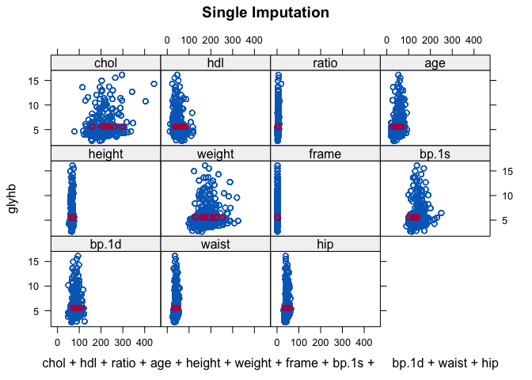

``` r
# chained model

C.imp = mice(DM,m = 20)
com = complete(C.imp,"long")
com = complete(C.imp)
model = with(data = C.imp,exp = 
               lm(glyhb~chol+hdl+ratio+age+height+
                    weight+frame+bp.1s+bp.1d+waist+hip) )
```

``` r
summary(pool(model))
```

    ##                 estimate   std.error   statistic       df      p.value
    ## (Intercept) -3.025130576 2.905890955 -1.04103376 355.0145 2.985135e-01
    ## chol         0.001434603 0.004456000  0.32194862 375.1046 7.476664e-01
    ## hdl          0.008195369 0.013889110  0.59005715 377.0426 5.554986e-01
    ## ratio        0.355305053 0.153731832  2.31120028 384.8163 2.134953e-02
    ## age          0.034788642 0.007959632  4.37063452 375.1066 1.595935e-05
    ## height       0.042934480 0.033533844  1.28033279 357.0384 2.011993e-01
    ## weight      -0.000281896 0.007162277 -0.03935843 309.7742 9.686250e-01
    ## frame       -0.045795095 0.170304098 -0.26890190 371.6590 7.881493e-01
    ## bp.1s        0.006163197 0.006542266  0.94205841 376.2582 3.467538e-01
    ## bp.1d       -0.010467693 0.009995244 -1.04726742 371.5434 2.956336e-01
    ## waist        0.034841091 0.041875873  0.83200871 355.1489 4.059200e-01
    ## hip          0.015778645 0.043210297  0.36515938 369.2304 7.151930e-01

``` r
model1 = with(data = C.imp,exp = 
                lm(glyhb~chol+hdl+ratio+age+
                     height+frame+bp.1s+bp.1d+waist+hip))
summary(pool(model1))
pool.compare(model,model1,method = "wald")

model2 = with(data = C.imp,exp =
                lm(glyhb~chol+hdl+ratio+age+
                     height+bp.1s+bp.1d+waist+hip))
summary(pool(model2))
pool.compare(model1,model2,method = "wald")

model3 = with(data = C.imp,exp = 
                lm(glyhb~hdl+ratio+age+
                     height+bp.1s+bp.1d+waist+hip) )
summary(pool(model3))
pool.compare(model2,model3,method = "wald")

model4 = with(data = C.imp,exp = lm(glyhb~
                                      hdl+ratio+
                                      age+height+bp.1s+
                                      bp.1d+waist) )
summary(pool(model4))
pool.compare(model3,model4,method = "wald")

model5 = with(data = C.imp,exp = lm(glyhb~hdl
                                    +ratio+age+
                                      height+bp.1d+waist) )
summary(pool(model5))
pool.compare(model4,model5,method = "wald")

model6 = with(data = C.imp,exp = lm(glyhb~hdl+
                                      ratio+age+
                                      height+waist) )
summary(pool(model6))
pool.compare(model5,model6,method = "wald")

model7 = with(data = C.imp,exp = lm(glyhb~hdl+
                                      ratio+age+
                                      waist) )
summary(pool(model7))
pool.compare(model6,model7,method = "wald")

model8 = with(data = C.imp,exp = lm(glyhb~
                                      ratio+age+
                                      waist) )
summary(pool(model8))
pool.compare(model7,model8,method = "wald")

model8 = with(data = C.imp,exp = lm(glyhb~
                                      ratio+age+
                                      waist) )
summary(pool(model8))
pool.compare(model7,model8,method = "wald")
model8$analyses
#names()
#?pool.compare
#x11()
multiple_coef<-round(summary(pool(model8)),2)
multiple_coef[,1] # estimates
multiple_coef[,2] # standard error
pool.compare(model3,model8,method = "wald")
```

``` r
# getting p value not significant
#so we are going for the simple model8
par(mfrow=c(2,1))
plot(C.imp, main='Convergence plot
     of imputed diabetes data') # converegence plot
```

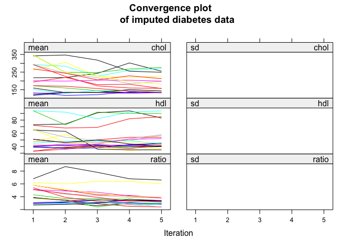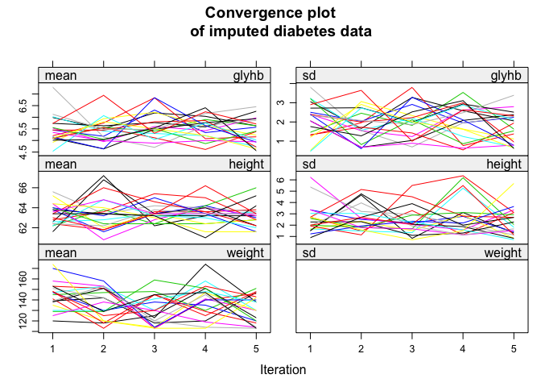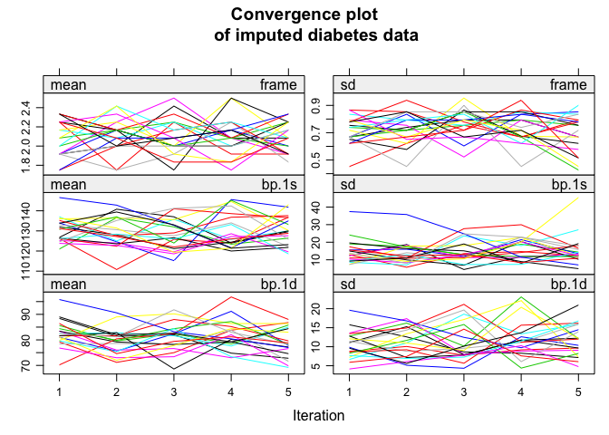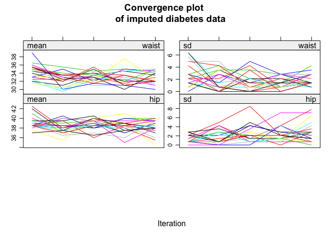

``` r
#par(mfrow=c(7,2))
```

``` r
attach(model8)
par(mfrow=c(4,4))
densityplot(C.imp, ~glyhb,main = 
              "Density plot of Imputations for glyhb")
```

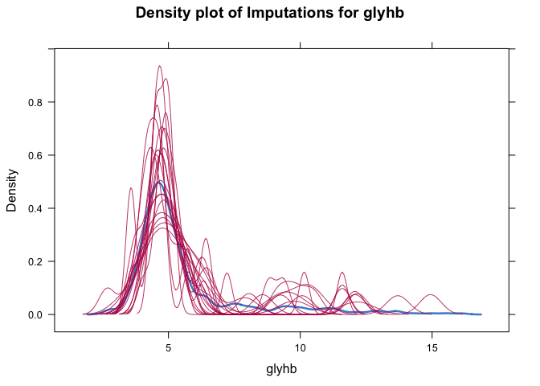

``` r
densityplot(C.imp, ~height,main =
              "Density plot of Imputations for height")
```

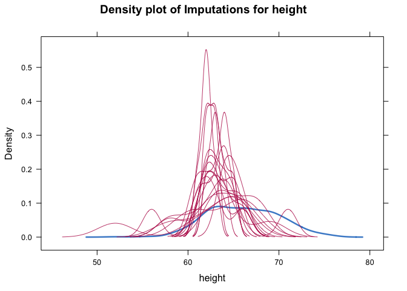

``` r
densityplot(C.imp, ~frame,main =
              "Density plot of Imputations for frame")
```

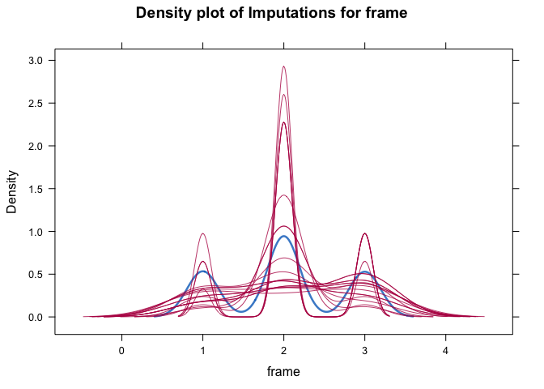

``` r
densityplot(C.imp, ~bp.1d,main = 
              "Density plot of Imputations for bp.1d")
```

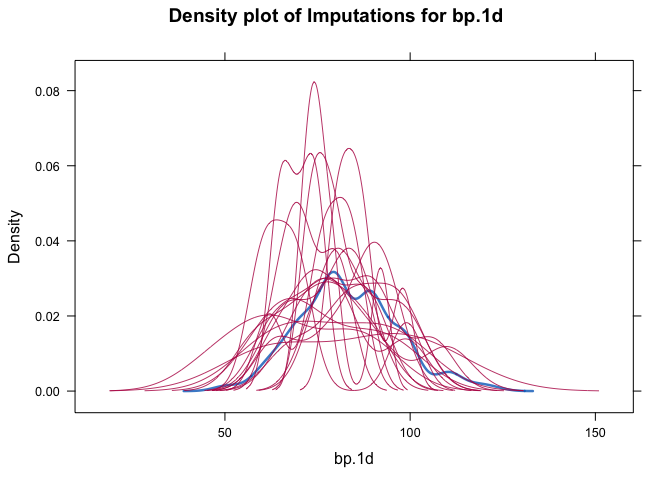

``` r
#x11()
```

``` r
stripplot(C.imp, main = 
            "Stripplot of all 
          imputations in diabetes dataset") # every single imputation
```

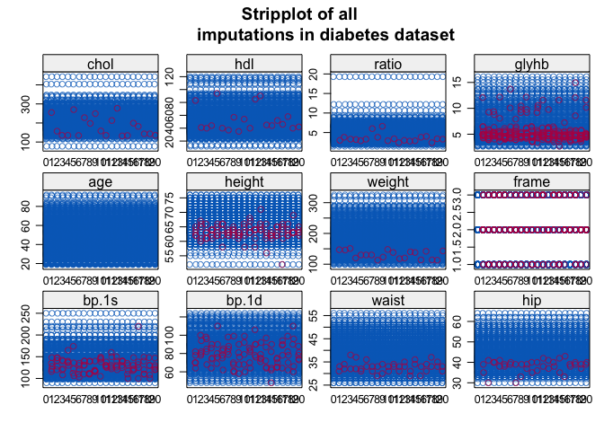

``` r
xyplot(C.imp,glyhb~chol+hdl+ratio
       +age+height+weight+frame+bp.1s+bp.1d+waist+hip,
       main="multiple chained imputations")
```

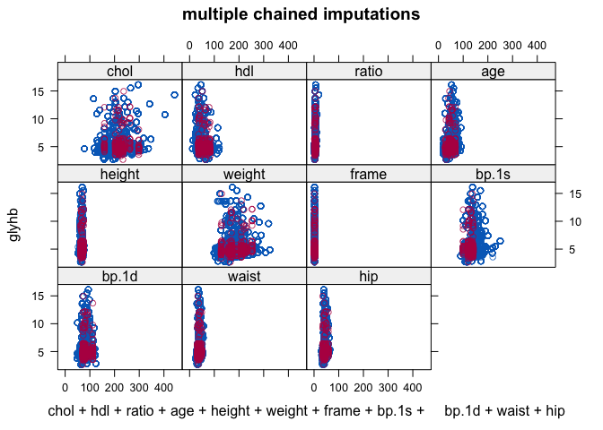

``` r
bwplot(C.imp,main="Box and whisker plot of 
       observed and imputed data in diabetes dataset")
```

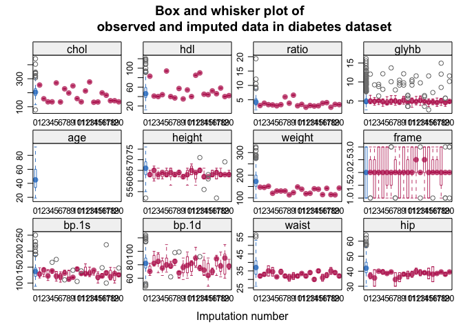

``` r
# SIMPLE VS CHAIN IMPUTATION
#pool.compare(Model3,model8,method = "wald")

NI=20

beta= lapply(model8$analyses,coefficients)
beta_col = matrix(0,ncol = 4,nrow = NI)

for (i in 1:NI) {beta_col[i,]=beta[[i]]}
head(beta_col)
beta_col
M = apply(beta_col,2, mean)
M
M_<-colMeans(beta_col)
M_
B=var(beta_col)
round(B,6)

Cov = lapply(model8$analyses, vcov)
Cov
Tot = matrix(0,ncol = 4,nrow = 4)
for (i in 1:NI ) {
  Tot = Tot + Cov[[i]]
}


Tot
w = Tot/NI
round(w,6)

T = w + B # inserted now
T
round(M,3)
round(B,6)##Between imputations variability
round(w,6) ##Within  imputation variability
round(T,6)##Total variability
#x11()
round(diag(B)/diag(T),3) # Fraction of information
#lost through missing data
```

``` r
barplot(round(diag(B)/diag(T),3), col = 1:4, main =
          "Fraction of information lost- Diabetes Data", ylim = c(0,0.1))
```

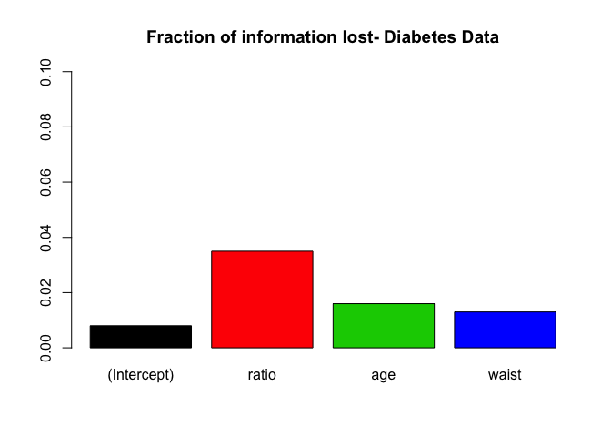

``` r
# coeeficients and estimates
par(las=2)
par(mfrow=c(1,3))
#estimates of the 3 models-complete, mean and multiple
barplot(round(complete_case
              $coefficients[c(1,3,4,5),1],3),
        col = 1:4,names.arg = rownames(complete_case),
        ylim = c(0,1)) #  estimates
barplot(mean_coef[,1], col = 1:5,names.arg = 
          rownames(mean_coef),ylim = c(0,1)) # estimates
barplot(multiple_coef[,1], col = 1:5,
        names.arg = rownames(multiple_coef),ylim = c(0,1)) # estimates
```

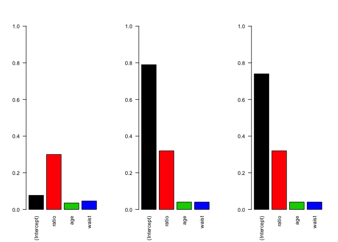

``` r
# standard errors of the 3 models-complete, mean and multiple
par(mfrow=c(1,3))
barplot(round(complete_case$coefficients
              [c(1,3,4,5),2],3),col = 1:4,
        names.arg = rownames(complete_case),
        ylim = c(0,1)) # standard errors
barplot(mean_coef[,2], col = 1:5,
        names.arg = rownames(mean_coef),
        ylim = c(0,1)) # standard errors
barplot(multiple_coef[,2], col = 1:5,
        names.arg = rownames(multiple_coef),
        ylim = c(0,1)) # standard error
```

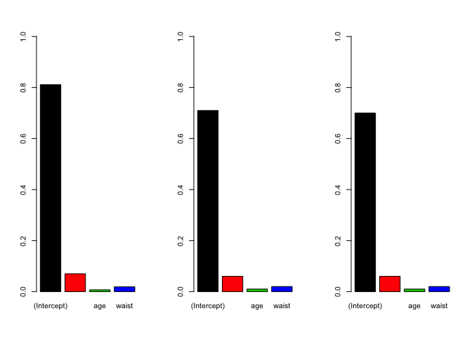

``` r
# note- none of thm show any variation- 
#both the coefficent and the standard errors
#x11()
beta_col_1<- beta_col[,c(1,2)]
#beta_col_1
beta_col_2<- beta_col[,c(1,3)]
#beta_col_2
beta_col_3<- beta_col[,c(1,4)]
#beta_col_3
# ratio
marginplot(cbind(DM$glyhb,DM$ratio),col=1:2,
           xlab="log life span",ylab="log gestation time")
for(i in 1:20){
  abline(beta_col_1[i,],col=3) #Draw fitted line for each MI data set
}
```

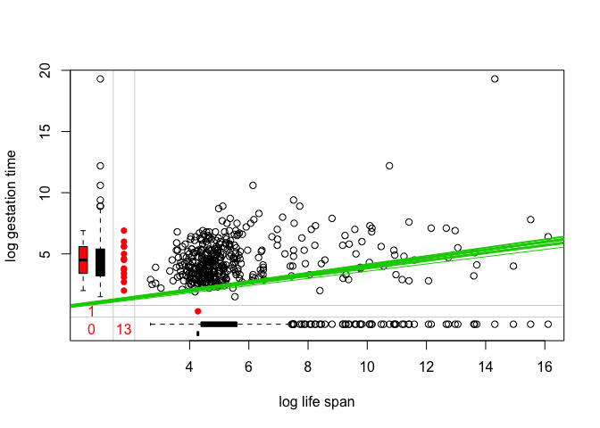
